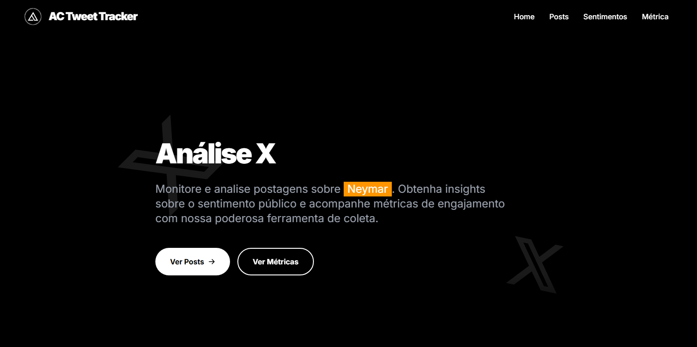

# Tweet Tracker 🐦

<p align="center">
  
</p>


<a href="https://app.netlify.com/sites/actweettracker/deploys">
  
</a>

O **Tweet Tracker** é um aplicativo web projetado para buscar, analisar e exibir tweets em tempo real usando a API [**Coletor de Tweets**](https://github.com/carvalhoandre?tab=repositories). Inicialmente focado em tweets relacionados a `Neymar`, fornece insights através de feeds ao vivo, análise de sentimentos e métricas horárias.

---

## 🚀 Funcionalidades

- ✅ **Tweets em tempo real** com indicadores de engajamento (likes, retweets, respostas)
- ✅ **Análise de sentimentos** dos tweets (positivo, negativo, neutro)
- ✅ **Dashboard interativo** com visualização dinâmica das métricas
- ✅ **Cálculo de Hype Score** para avaliar tendências e engajamento
- ✅ **Interface responsiva e moderna** utilizando Tailwind CSS

---

## 🛠️ Tecnologias

- ⚛️ **React 19 + Vite** — Desenvolvimento ágil e performance otimizada
- 🎨 **Tailwind CSS** — Estilização eficiente e responsiva
- 🌐 **Axios** — Consumo fácil e rápido de APIs REST
- 📊 **Recharts** — Visualização interativa de dados com gráficos
- 🚏 **React Router** — Navegação fluida entre seções da aplicação

---

## 📂 Estrutura do Projeto

```
📂 tweet-tracker/
├── 📂 src/
│   ├── 📂 components/            # Componentes reutilizáveis
│   │   ├── Header.jsx            # Cabeçalho do app
│   │   ├── Hero.jsx              # Seção inicial de destaque
│   │   ├── TweetsSection.jsx     # Exibição dos tweets coletados
│   │   ├── DashboardSection.jsx  # Dashboard de gráficos e métricas
│   │   └── HypeChart.jsx         # Gráfico visual do Hype Score
│   ├── 📂 hooks/                 # Hooks personalizados
│   │   └── useFetch.js           # Busca e tratamento de dados
│   ├── 📂 services/              # Camada de comunicação com APIs
│   │   ├── api.js                # Configuração global do Axios
│   │   └── tweets.js             # Chamadas à API de tweets e métricas
│   ├── 📂 styles/                # Estilos adicionais Tailwind
│   ├── App.jsx                   # Componente principal da aplicação
│   ├── main.jsx                  # Entrada da aplicação React
│   └── index.css                 # Estilos globais e resets
├── .env                          # Variáveis de ambiente
├── package.json                  # Dependências do projeto
└── README.md                     # Documentação do projeto
```

---

## 🚀 Como Executar o Projeto

Clone o repositório:

```bash
git clone https://github.com/carvalhoandre/tweet-tracker.git
cd tweet-tracker
```

Instale as dependências:

```bash
npm install
```

Execute o projeto localmente:

```bash
npm run dev
```

Acesse o projeto em:

```
http://localhost:5173
```

---

## 🌱 Contribuição

Contribuições são bem-vindas! Para contribuir:

1. Faça um fork do projeto.
2. Crie uma branch para sua feature ou correção (`git checkout -b minha-feature`).
3. Commit suas mudanças (`git commit -m 'feat: descrição da feature'`).
4. Push para sua branch (`git push origin minha-feature`).
5. Abra um Pull Request.

---
